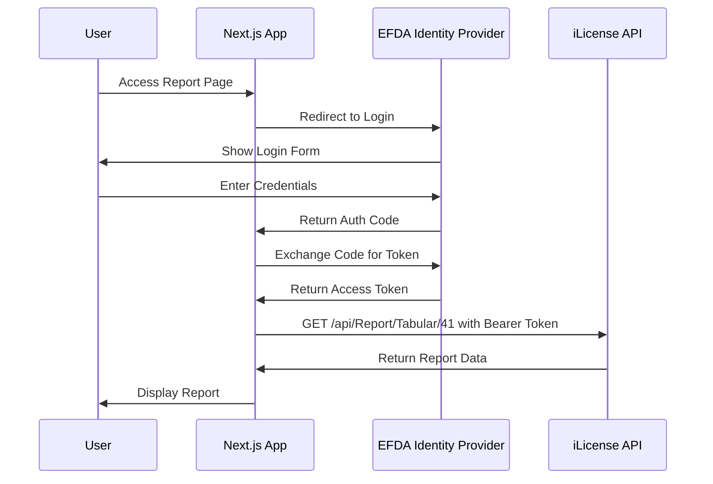

# Next.js iLicense API Integration Plan

This plan outlines how to access `https://ilicense.staging.api.efda.gov.et/api/Report/Tabular/41` in your Next.js app using the same OIDC authentication as the Angular eris-portal.

## Authentication Configuration Reference

From the Angular app, the OIDC configuration is:| Setting | Value ||---------|-------|| Authority (STS) | `https://dev.id.eris.efda.gov.et` || Client ID | `eris-portal-spa` || Scopes | `openid profile` || Response Type | `code` (Authorization Code Flow) || Token Storage | localStorage |

## Architecture Overview




## Implementation Steps

### Step 1: Install Dependencies

```bash
npm install oidc-client-ts
# OR for Next.js App Router with next-auth
npm install next-auth
```

**Recommendation**: Use `oidc-client-ts` (TypeScript version of `oidc-client`) since it matches the Angular implementation most closely.

### Step 2: Create Environment Variables

Create `.env.local`:

```env
NEXT_PUBLIC_STS_AUTHORITY=https://dev.id.eris.efda.gov.et
NEXT_PUBLIC_CLIENT_ID=eris-portal-spa
NEXT_PUBLIC_CLIENT_ROOT=http://localhost:3000
NEXT_PUBLIC_REDIRECT_URI=http://localhost:3000/auth-callback
NEXT_PUBLIC_CLIENT_SCOPE=openid profile
NEXT_PUBLIC_ILICENSE_API_BASE=https://ilicense.staging.api.efda.gov.et
```


### Step 3: Create Auth Service

Create `lib/auth.ts`:

```typescript
import { UserManager, WebStorageStateStore, User } from 'oidc-client-ts';

const settings = {
  authority: process.env.NEXT_PUBLIC_STS_AUTHORITY!,
  client_id: process.env.NEXT_PUBLIC_CLIENT_ID!,
  redirect_uri: process.env.NEXT_PUBLIC_REDIRECT_URI!,
  silent_redirect_uri: `${process.env.NEXT_PUBLIC_CLIENT_ROOT}/silent-callback.html`,
  post_logout_redirect_uri: process.env.NEXT_PUBLIC_CLIENT_ROOT!,
  response_type: 'code',
  scope: process.env.NEXT_PUBLIC_CLIENT_SCOPE!,
  userStore: new WebStorageStateStore({ store: typeof window !== 'undefined' ? window.localStorage : undefined }),
};

export const userManager = typeof window !== 'undefined' ? new UserManager(settings) : null;

export const login = () => userManager?.signinRedirect();
export const logout = () => userManager?.signoutRedirect();
export const getUser = () => userManager?.getUser();
export const getAccessToken = async (): Promise<string | null> => {
  const user = await userManager?.getUser();
  return user?.access_token ?? null;
};
```


### Step 4: Create Auth Context/Hook

Create `hooks/useAuth.ts`:

```typescript
import { useState, useEffect, createContext, useContext } from 'react';
import { User } from 'oidc-client-ts';
import { userManager, getUser, login, logout } from '@/lib/auth';

export function useAuth() {
  const [user, setUser] = useState<User | null>(null);
  const [loading, setLoading] = useState(true);

  useEffect(() => {
    getUser().then((u) => {
      setUser(u);
      setLoading(false);
    });
  }, []);

  return {
    user,
    loading,
    isAuthenticated: !!user && !user.expired,
    accessToken: user?.access_token,
    login,
    logout,
  };
}
```


### Step 5: Create Auth Callback Page

Create `app/auth-callback/page.tsx` (App Router) or `pages/auth-callback.tsx` (Pages Router):

```typescript
'use client';
import { useEffect } from 'react';
import { useRouter } from 'next/navigation';
import { userManager } from '@/lib/auth';

export default function AuthCallback() {
  const router = useRouter();

  useEffect(() => {
    userManager?.signinRedirectCallback().then(() => {
      router.push('/');
    });
  }, [router]);

  return <div>Processing authentication...</div>;
}
```


### Step 6: Create API Utility for iLicense

Create `lib/api.ts`:

```typescript
import { getAccessToken } from './auth';

const ILICENSE_API_BASE = process.env.NEXT_PUBLIC_ILICENSE_API_BASE;

export async function fetchWithAuth<T>(endpoint: string): Promise<T> {
  const token = await getAccessToken();
  
  if (!token) {
    throw new Error('Not authenticated');
  }

  const response = await fetch(`${ILICENSE_API_BASE}${endpoint}`, {
    headers: {
      'Authorization': `Bearer ${token}`,
      'Content-Type': 'application/json',
    },
  });

  if (!response.ok) {
    throw new Error(`API Error: ${response.status}`);
  }

  return response.json();
}

// Specific function for the tabular report
export async function getTabularReport(reportId: number) {
  return fetchWithAuth(`/api/Report/Tabular/${reportId}`);
}
```


### Step 7: Use in Your Component

```typescript
'use client';
import { useEffect, useState } from 'react';
import { useAuth } from '@/hooks/useAuth';
import { getTabularReport } from '@/lib/api';

export default function ReportPage() {
  const { isAuthenticated, login } = useAuth();
  const [reportData, setReportData] = useState(null);

  useEffect(() => {
    if (isAuthenticated) {
      getTabularReport(41).then(setReportData);
    }
  }, [isAuthenticated]);

  if (!isAuthenticated) {
    return <button onClick={login}>Login to view report</button>;
  }

  return <pre>{JSON.stringify(reportData, null, 2)}</pre>;
}
```


## Key Points

1. **Token Header Format**: All API requests must include `Authorization: Bearer {access_token}` header (matching the Angular interceptor pattern)
2. **Token Storage**: Uses `localStorage` via `WebStorageStateStore` (same as Angular app)
3. **Client Registration**: Your Next.js app may need to be registered as a client with the identity provider if using a different redirect URI than the Angular app
4. **CORS Considerations**: If calling the iLicense API directly from the browser, ensure CORS is configured on the API server. Otherwise, create a Next.js API route to proxy the requests.

## Alternative: Server-Side API Route (Recommended for Security)

If you prefer to keep the token on the server side:Create `app/api/report/[id]/route.ts`:

```typescript
import { NextRequest, NextResponse } from 'next/server';
import { cookies } from 'next/headers';

export async function GET(req: NextRequest, { params }: { params: { id: string } }) {
  const token = cookies().get('access_token')?.value;
  
  const response = await fetch(
    `https://ilicense.staging.api.efda.gov.et/api/Report/Tabular/${params.id}`,
    { headers: { Authorization: `Bearer ${token}` } }
  );

  const data = await response.json();
  return NextResponse.json(data);
}

```